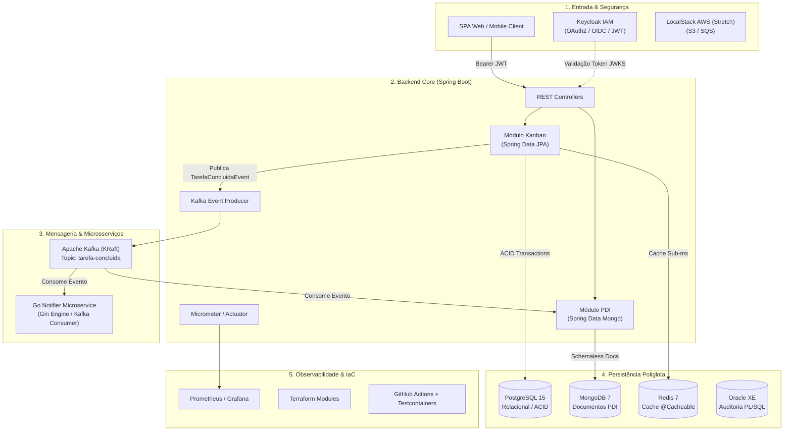

# FlowTask + PDI 🚀

[](https://openjdk.org/)
[](https://spring.io/projects/spring-boot)
[](https://www.postgresql.org/)
[](https://www.mongodb.com/)
[](https://kafka.apache.org/)
[](https://www.terraform.io/)
[](https://www.keycloak.org/)

> **FlowTask** é um ecossistema backend moderno desenvolvido em **Java (Spring Boot)** e **Go**, combinando **gestão ágil de tarefas (Kanban)** com um módulo de **Plano de Desenvolvimento Individual (PDI)**. O projeto adota **persistência poliglota consciente**, **comunicação assíncrona orientada a eventos (EDA)** e **práticas corporativas de observabilidade e infraestrutura como código**.

---

## 🎯 Hub Visual, Portal de Engenharia & Central de Conhecimento

O **FlowTask** conta com um portal visual rico publicado diretamente no **GitHub Pages**, estruturado como um hub central de engenharia e estudos:

👉 **[Acessar Portal Central & Hub de Documentação (GitHub Pages)](https://vitoriabarbosa42.github.io/FlowTask-PDI/)** *(ou localmente em [`docs/index.html`](docs/index.html))*

### 🌟 Módulos Disponíveis no Portal:
- 🏠 **Home & Hub do Ecossistema**: Visão geral da arquitetura, stack tecnológica e atalhos rápidos em grade.
- 📋 **Quadro Kanban Ágil (Tela Separada)**: Gestão interativa de tarefas dos 6 épicos com suporte a *drag & drop*, filtros avançados e persistência do progresso local.
- 📁 **Explorador Hierárquico de Pastas & Documentação (`docs/`)**: Navegador visual interativo unificado para inspecionar specs SDD (`docs/refinamento-tecnico/`), planos de arquitetura, anotações de estudo (`docs/anotacoes/`) e relatórios técnicos.
- 🏛️ **System Design Explorer**: Diagrama visual interativo da topologia com simulador em tempo real do ciclo de eventos Kafka.
- ⚖️ **Matriz de Trade-offs & ADRs**: Comparativo técnico de decisões (Postgres vs Mongo, Kafka vs RabbitMQ, Go vs Java) e simulador de entrevistas Itaú.
- 📅 **Sprint Roadmap & Releases**: Sequenciamento lógico dos 6 ciclos de entrega e metas *Stretch*.

---

## 🏛️ Arquitetura do Sistema



---

## 🛠️ Stack Tecnológica

| Camada | Tecnologias & Ferramentas |
| :--- | :--- |
| **Backend Core** | Java 25, Spring Boot 3.x / 4.x, Spring Data JPA, Spring Data MongoDB, Spring Kafka, Lombok |
| **Microsserviço** | Go (Golang), Gin Web Framework, Sarama Kafka Client |
| **Bancos de Dados** | PostgreSQL 15, MongoDB 7.0, Redis 7 (In-Memory Cache), Oracle Database XE *(Stretch)* |
| **Mensageria** | Apache Kafka (KRaft Mode sem ZooKeeper) |
| **Segurança & IAM** | Keycloak IAM, OAuth2.0, OpenID Connect, Spring Security JWT Bearer |
| **Observabilidade** | Micrometer, Prometheus, Grafana, Mapeamento conceitual Datadog |
| **Infra & DevOps** | Docker, Docker Compose, Terraform (Provider Docker/LocalStack), Testcontainers, GitHub Actions |

---

## 🤖 Suíte de Skills SDD para Agentes de IA (`.agents/skills/`)

O repositório possui uma suíte completa de habilidades operacionais para desenvolvimento orientado a especificações:

| Skill | Comando | Descrição & Entregável |
| :--- | :--- | :--- |
| **Refinamento Geral** | `/sdd-refinar <tema>` | 🚀 Orquestrador mestre gerando os 3 arquivos HTML do incremento |
| **Fase 1: Spec** | `/sdd-spec` | 📝 Entrevista de requisitos RF/RNF e geração de `<feature>-spec.html` |
| **Fase 2: Plan** | `/sdd-plan` | 📐 Planejamento técnico, ADRs e diagramas em `<feature>-plan.html` |
| **Fase 3: Tasks** | `/sdd-tasks` | 📋 Decomposição em micro-tarefas com checklist em `<feature>-tasks.html` |
| **Fase 4: Impl** | `/sdd-implement` | 💻 Implementação com commits semânticos atômicos por tarefa |
| **Fase 5: Verify** | `/sdd-verify` | 🧪 Auditoria de critérios de aceite e relatório em `<feature>-qa.html` |
| **Anotações de Estudo** | `/anotacoes-estudo` | 📚 Geração de material didático em `docs/anotacoes/<categoria>/` |

---

## 🚀 Como Rodar o Projeto

### Pré-requisitos
- **Git** instalado
- **Docker & Docker Compose** (ou Docker Desktop)
- **JDK 21+ ou JDK 25** instalado

---

### 1. Clonar o repositório
```bash
git clone https://github.com/VitoriaBarbosa42/FlowTask-PDI.git
cd FlowTask-PDI
```

---

### 2. Subir a infraestrutura (PostgreSQL, pgAdmin e Keycloak)
```bash
docker-compose up -d
```

Verifique o status dos containers:
```bash
docker-compose ps
```

#### 🌐 Serviços e Portas Locais:
- **PostgreSQL**: `localhost:5432` *(User: `postgres` | Senha: `postgres` | DB: `flowtask`)*
- **pgAdmin 4**: [http://localhost:5050](http://localhost:5050) *(Login: `admin@flowtask.com` | Senha: `admin`)*
- **Keycloak IAM**: [http://localhost:8080](http://localhost:8080) *(Login: `admin` | Senha: `admin`)*
- **Portal Central (Hub & Docs)**: abra o arquivo [`docs/index.html`](docs/index.html) no navegador

---

### 3. Executar o Backend Spring Boot

Acesse o diretório da aplicação:
```bash
cd flowtask
```

Executar em modo desenvolvimento via Maven Wrapper:
```bash
# No Linux / macOS:
./mvnw spring-boot:run

# No Windows (PowerShell / CMD):
.\mvnw.cmd spring-boot:run
```

Ou compilar o pacote JAR e executar:
```bash
# Build (pulando testes se necessário)
./mvnw clean package -DskipTests

# Execução do JAR gerado
java -jar target/*.jar
```

---

### 4. Parar e limpar o ambiente

Para pausar os containers:
```bash
docker-compose down
```

Para remover os volumes persistentes e resetar a base de dados:
```bash
docker-compose down -v
```

---

## 🗺️ Roadmap de Sprints & Épicos

| Sprint | Épico | Foco Principal | Entregável Chave |
| :---: | :--- | :--- | :--- |
| **Sprint 1-2** | **Epic 5: Infraestrutura como Código** | Terraform com provider Docker modularizado (`modules/postgres`, `mongo`, `redis`, `kafka`) | Pasta `infra/` versionada com `terraform plan/apply` |
| **Sprint 3-4** | **Epic 1: Persistência Poliglota** | Migração do Kanban para PostgreSQL (JPA), PDI em MongoDB e cache Redis (`@Cacheable`) | ADR documentando a escolha de cada banco |
| **Sprint 5-6** | **Epic 2: Mensageria & Eventos** | Apache Kafka KRaft desacoplando conclusão de tarefas e atualização do PDI | Fluxo de eventos assíncrono + testes de integração |
| **Sprint 7** | **Epic 3: Microsserviço em Go** | Serviço leve de notificações em Go (Gin) consumindo eventos Kafka | Serviço standalone com Dockerfile multi-stage |
| **Sprint 8** | **Epic 4: Observabilidade** | Instrumentação Micrometer, endpoints Prometheus e dashboards Grafana | Dashboard com métricas de latência e throughput |
| **Sprint 9-10** | **Epic 6: CI/CD & Clean Architecture** | Pipeline GitHub Actions com Testcontainers e revisão SOLID | Pipeline verde automatizada e documentação de portfólio |

---

## 📁 Estrutura do Repositório

```text
FlowTask-PDI/
├── .agents/                                 # Configurações e Suíte de Skills SDD para Agentes de IA
│   └── skills/
│       ├── sdd-refinar/                     # 🚀 Orquestrador de Refinamento Técnico Completo
│       ├── sdd-spec/                        # 📝 Fase 1: Levantamento de Requisitos RF/RNF & Spec HTML
│       ├── sdd-plan/                        # 📐 Fase 2: Planejamento Técnico, Arquitetura & ADRs HTML
│       ├── sdd-tasks/                       # 📋 Fase 3: Micro-Tarefas Atômicas & Checklist Interativo
│       ├── sdd-implement/                   # 💻 Fase 4: Execução com Commits Semânticos
│       ├── sdd-verify/                      # 🧪 Fase 5: Auditoria de Critérios de Aceite & QA HTML
│       └── anotacoes-estudo/                # 📚 Gerador de material didático em HTML
├── docs/                                    # 🌐 Publicação no GitHub Pages
│   ├── index.html                           # 🌟 Portal Central & Hub de Módulos
│   ├── anotacoes/                           # 📚 Central de Estudos & Didática (por Categoria)
│   │   ├── metodologias/
│   │   │   ├── anatomia-de-uma-especificacao.html
│   │   │   ├── ciclo-e-fases-do-sdd.html
│   │   │   └── spec-driven-development-fundamentos.html
│   │   ├── backend-java/                    # Anotações e exercícios de Java & Spring Boot
│   │   ├── backend-go/                      # Anotações e exercícios de Go
│   │   ├── arquitetura-infra/               # Anotações de Docker, Kafka e Terraform
│   │   └── testes-qa/                       # Anotações de Testcontainers e JUnit
│   └── refinamento-tecnico/                 # 📋 Central de Refinamento Técnico & SDD (por Épico)
│       ├── plano-geral/
│       │   └── flowtask-plano-refinamento-itau.html # Visão macro de Sprints & Preparação Itaú
│       ├── epic-01-persistencia/            # Specs, Plans e Tasks do Epic 1
│       ├── epic-02-mensageria/              # Specs, Plans e Tasks do Epic 2
│       ├── epic-03-go-service/              # Specs, Plans e Tasks do Epic 3
│       ├── epic-04-observabilidade/         # Specs, Plans e Tasks do Epic 4
│       ├── epic-05-iac-terraform/           # Specs, Plans e Tasks do Epic 5
│       └── epic-06-cicd-qualidade/          # Specs, Plans e Tasks do Epic 6
├── flowtask/                                # Aplicação Spring Boot (Java 25)
│   ├── src/main/java/br/com/flowtask/       # Controllers, Services, Models e Security
│   ├── src/main/resources/                  # application.yaml e schema.sql
│   ├── mvnw / mvnw.cmd                      # Maven Wrapper
│   └── pom.xml                              # Dependências do projeto
├── keycloak-config/
│   └── flowtask-realm.json                  # Realm pré-configurado do Keycloak
├── docker-compose.yaml                      # Orquestração local dos containers
└── README.md                                # Documentação principal
```

---

## 📚 Documentações Complementares & GitHub Pages

- 🌟 **[Portal Central & Hub Interativo (GitHub Pages)](https://vitoriabarbosa42.github.io/FlowTask-PDI/)** *(ou localmente em [`docs/index.html`](docs/index.html))*
- 📋 **[Plano de Refinamento Técnico & Itaú Prep](docs/refinamento-tecnico/plano-geral/flowtask-plano-refinamento-itau.html)**
- 📐 **[O Ciclo e as Fases do SDD](docs/anotacoes/metodologias/ciclo-e-fases-do-sdd.html)**
- 📐 **[Anatomia de uma Especificação (Spec)](docs/anotacoes/metodologias/anatomia-de-uma-especificacao.html)**
- 📐 **[Spec-Driven Development (SDD) — Fundamentos & Prática](docs/anotacoes/metodologias/spec-driven-development-fundamentos.html)**
